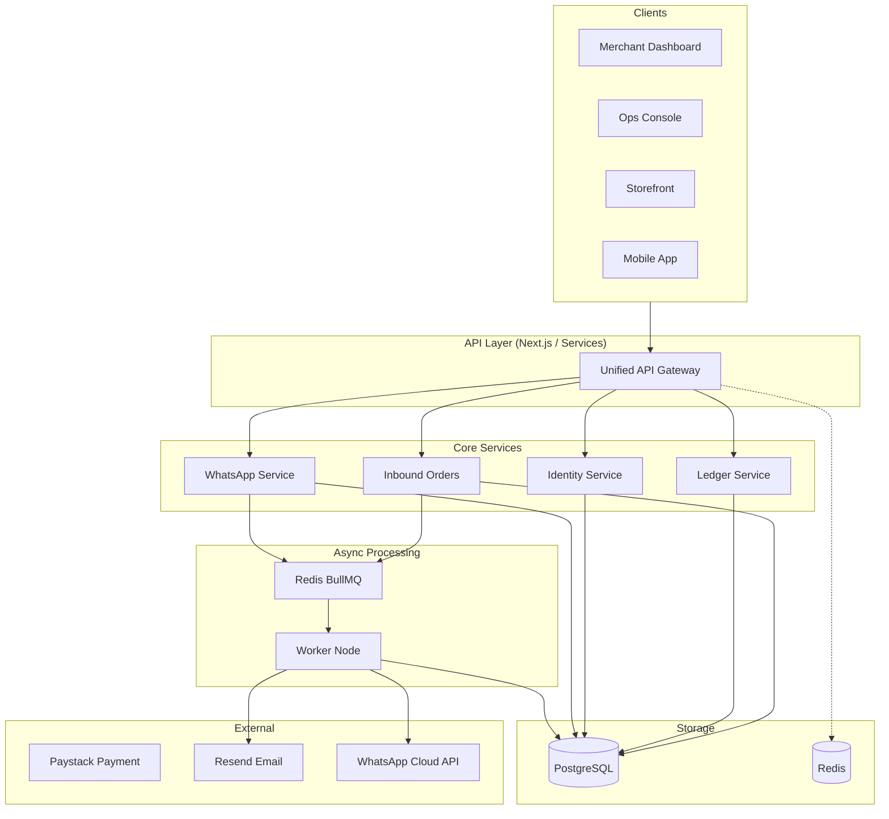

# Vayva Platform Architecture

## System Overview

Vayva is designed as a modular, high-performance monorepo facilitating a multi-tenant commerce engine. The system is composed of distinct applications and services that communicate via standardized APIs and strictly typed contracts.

### Core Components

1.  **Web Applications (`apps/`)**:
    - **Merchant Dashboard**: Next.js App Router application for merchants to manage their business.
    - **Ops Console**: Internal administrative tool for platform oversight.
    - **Storefront**: Performance-optimized public facing store for customers.
    - **Mobile**: React Native application for merchants on the go.

2.  **Workers (`apps/worker`)**:
    - **Worker Node**: Background processing engine handling asynchronous tasks.
    - **Responsibilities**: Email delivery, WhatsApp message processing, Webhook ingestion, Order syncing.

3.  **Services (`services/`)**:
    - **Domain-specific backend logic** isolated by context.
    - **Auth**: Authentication & Identity management.
    - **Ledger**: Double-entry financial recording system.
    - **Orders**: Order lifecycle management.
    - **WhatsApp**: Connector for WhatsApp Business API interactions.

4.  **Data Layer**:
    - **PostgreSQL**: Primary transactional database.
    - **Redis**: Caching and Job Queue (BullMQ) storage.

## Architecture Diagram

## Service Contracts

The system relies on strict contracts for inter-service communication and background processing.

### Worker Node

**Input/Output Model:**
All jobs are pushed to Redis queues. The worker polls these queues and executes the corresponding job processor.

| Queue Name         | Payload Type      | Description                                        |
| :----------------- | :---------------- | :------------------------------------------------- |
| `email`            | `SendEmailJob`    | Transactional emails (Welcome, Order Confirm)      |
| `whatsapp-inbound` | `WhatsAppMessage` | Raw webhooks from Meta to be processed             |
| `webhook-delivery` | `WebhookPayload`  | Events to be sent to merchant-configured endpoints |
| `orders-sync`      | `OrderSyncJob`    | Syncing orders between cache and primary DB        |

**Message Processing Pipeline (WhatsApp):**

1.  **Ingestion**: Webhook received -> Pushed to `whatsapp-inbound` queue.
2.  **Normalization**: Worker validates signature -> Normalizes to internal `Message` format.
3.  **Routing**: Agent Router determines intent (Sales vs Support) -> Dispatches to AI or Support Inbox.
4.  **Response**: AI generates response -> Pushed to `whatsapp-outbound` queue -> Sent to Meta.

**Delivery Scheduling Flow:**

1.  Order placed -> `order.created` event fired.
2.  Logistics Service evaluates routing rules.
3.  Delivery Job scheduled with 3rd party provider (e.g., Kwik).
4.  Worker executes booking -> Updates Order Status.

### Webhook Boundaries

- **Inbound**: All external webhooks (Paystack, Meta) are verified at the Edge and instantly pushed to a Queue to ensure 200 OK response times. Processing happens asynchronously.
- **Outbound**: Retries are handled by BullMQ with exponential backoff.

## Data Ownership

Services own specific database tables to maintain domain boundaries.

| Service / Domain    | Owned Tables                                           | Access Type                                                            |
| :------------------ | :----------------------------------------------------- | :--------------------------------------------------------------------- |
| **Auth / Identity** | `User`, `Account`, `Session`, `VerificationToken`      | **Write**: Exclusive   **Read**: Shared (via libraries)             |
| **Merchant**        | `Merchant`, `Store`, `TeamMember`, `BusinessProfile`   | **Write**: Merchant Service   **Read**: Shared                      |
| **Catalog**         | `Product`, `Variant`, `Collection`, `Inventory`        | **Write**: Catalog Service   **Read**: Storefront / Orders          |
| **Orders**          | `Order`, `OrderItem`, `Fulfillment`, `ShippingAddress` | **Write**: Order Service   **Read**: Shared                         |
| **Ledger**          | `Transaction`, `Wallet`, `Payout`, `AuditLog`          | **Write**: Ledger Service (Append-Only)   **Read**: Admin / Payouts |
| **Communication**   | `EmailLog`, `WhatsAppMessage`, `Conversation`          | **Write**: Worker / Comm Service   **Read**: Admin                  |

**Rules:**

1.  Services should not write to tables they do not own.
2.  Cross-domain data requirements should be handled via Service APIs or shared schema libraries with strict ACL.
