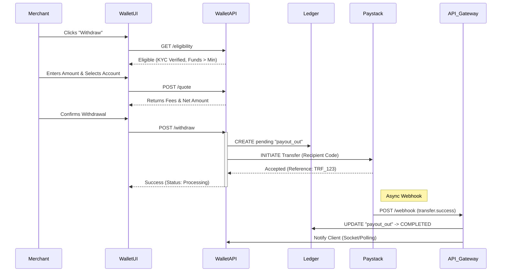
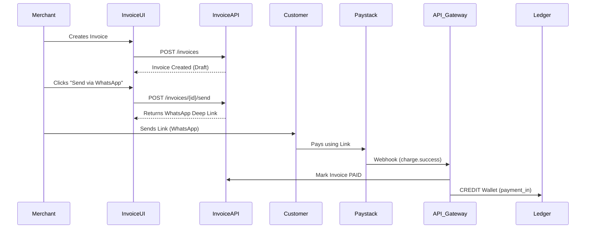

# Data Flow Document

## 1. Withdrawal Flow

```mermaid
sequenceDiagram
    participant Merchant
    participant WalletUI
    participant WalletAPI
    participant Ledger
    participant Paystack

    Merchant->>WalletUI: Clicks "Withdraw"
    WalletUI->>WalletAPI: GET /eligibility
    WalletAPI-->>WalletUI: Eligible (KYC Verified, Funds > Min)
    
    Merchant->>WalletUI: Enters Amount & Selects Account
    WalletUI->>WalletAPI: POST /quote
    WalletAPI-->>WalletUI: Returns Fees & Net Amount
    
    Merchant->>WalletUI: Confirms Withdrawal
    WalletUI->>WalletAPI: POST /withdraw
    
    activate WalletAPI
    WalletAPI->>Ledger: CREATE pending "payout_out"
    WalletAPI->>Paystack: INITIATE Transfer (Recipient Code)
    Paystack-->>WalletAPI: Accepted (Reference: TRF_123)
    WalletAPI-->>WalletUI: Success (Status: Processing)
    deactivate WalletAPI
    
    Note right of Paystack: Async Webhook
    Paystack->>API_Gateway: POST /webhook (transfer.success)
    API_Gateway->>Ledger: UPDATE "payout_out" -> COMPLETED
    API_Gateway->>WalletAPI: Notify Client (Socket/Polling)
```

## 2. Invoicing Flow

```mermaid
sequenceDiagram
    participant Merchant
    participant InvoiceUI
    participant InvoiceAPI
    participant Customer
    
    Merchant->>InvoiceUI: Creates Invoice
    InvoiceUI->>InvoiceAPI: POST /invoices
    InvoiceAPI-->>InvoiceUI: Invoice Created (Draft)
    
    Merchant->>InvoiceUI: Clicks "Send via WhatsApp"
    InvoiceUI->>InvoiceAPI: POST /invoices/{id}/send
    InvoiceAPI-->>InvoiceUI: Returns WhatsApp Deep Link
    
    Merchant->>Customer: Sends Link (WhatsApp)
    Customer->>Paystack: Pays using Link
    Paystack->>API_Gateway: Webhook (charge.success)
    API_Gateway->>InvoiceAPI: Mark Invoice PAID
    API_Gateway->>Ledger: CREDIT Wallet (payment_in)
```
